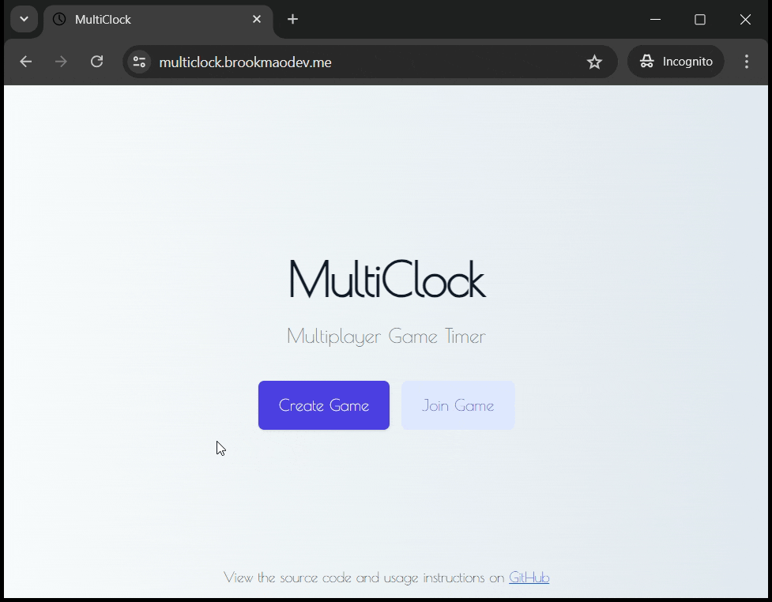

# MultiClock - Multiplayer Game Timer

MultiClock is perfect for preventing multiplayer games from lasting too long, whether they're played online or in person. I decided to build this project after a game of 4-player chess with friends lasted over 3 hours!

## Usage Instructions

1. Click the 'Create Game' button and fill out the form to create a new game that users can join.
2. Have your friends click the 'Join Game' button and fill out the form to join the game.
3. Once everyone has joined, click 'Start' to begin the multiplayer clock.



## Technologies Used

- **Frontend**: React, Tailwind CSS
- **Backend**: Node, Express, Socket.IO
- **Database**: MongoDB
- **HTTPS Encryption**: NGINX, Let's Encrypt
- **Deployment**: Amazon EC2, Docker, GitHub Actions

## How to Build

Follow these steps to build and run MultiClock locally:

1. Fork the repository by clicking the "Fork" button at the top right of the repository page on GitHub.

2. Clone your forked repository using the following command, replacing `<your-username>` with your GitHub username:

   ```bash
   git clone https://github.com/<your-username>/MultiClock.git
   ```

3. Install Docker Desktop from [here](https://www.docker.com/products/docker-desktop/).

4. Open a terminal in the repository directory and run the following command to build and start the containers:

   ```bash
   docker-compose -f "docker-compose.yml" up -d --build
   ```

5. Open your web browser and go to [http://localhost](http://localhost) to access MultiClock.
